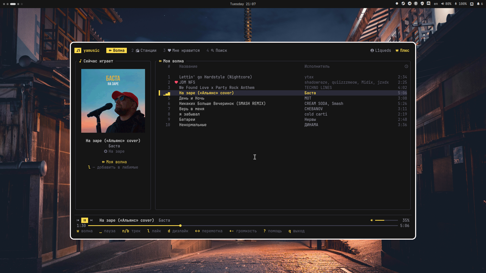
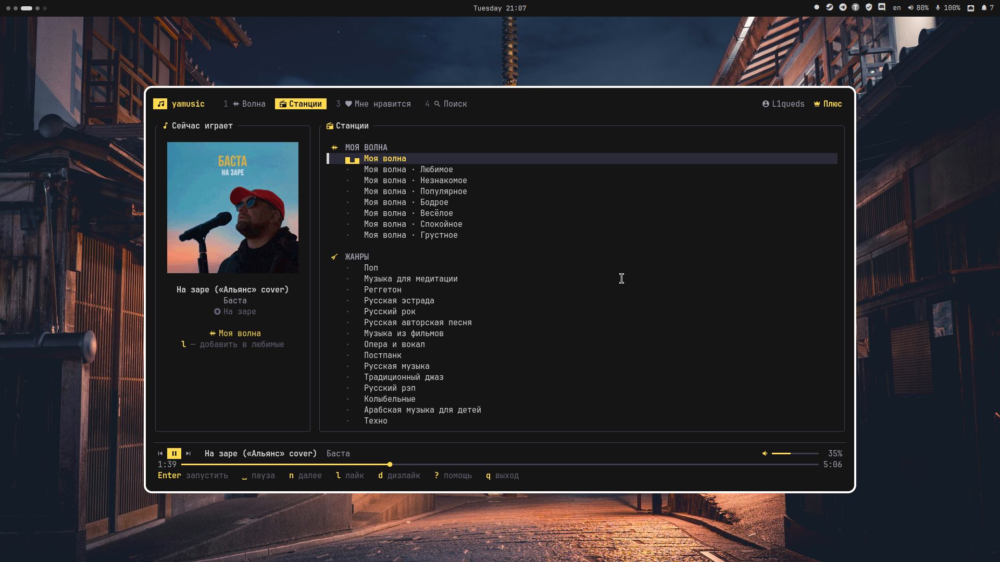
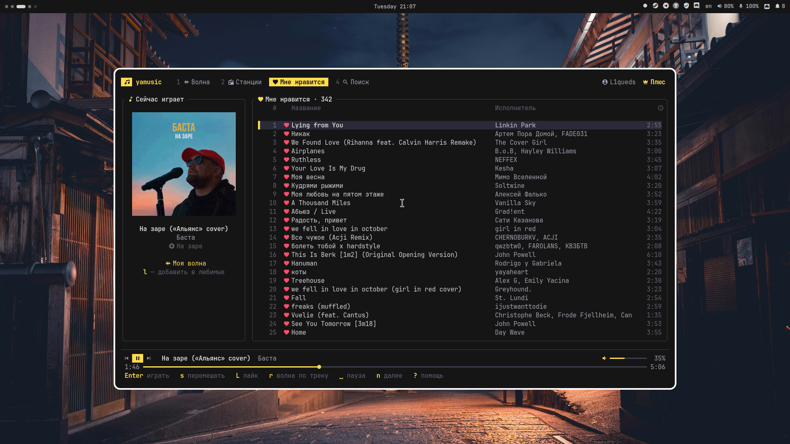
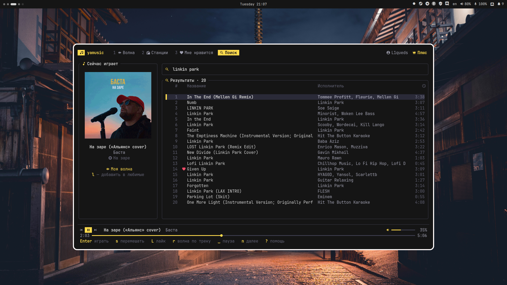

# yamusic-cli

**Яндекс Музыка в терминале.** Моя волна, лайки, станции по жанрам и настроениям, поиск — с понятными горячими клавишами.

<p align="center">
  
</p>

<table>
  <tr>
    <td align="center"><br><sub>Станции: жанры, настроения, занятия</sub></td>
    <td align="center"><br><sub>Мне нравится</sub></td>
    <td align="center"><br><sub>Поиск</sub></td>
  </tr>
</table>

> Иконки — из [Nerd Fonts](https://www.nerdfonts.com) (например, JetBrainsMono Nerd Font: `pacman -S ttf-jetbrains-mono-nerd`).
> Без Nerd Font запускайте `yamusic --no-icons` или поставьте `"icons": false` в конфиге.

## Возможности

- **Моя волна** — персональный поток рекомендаций, как в приложении.
- **Лайки и дизлайки учитываются волной**: лайк/дизлайк сохраняется в аккаунт и отправляется
  волне как событие обратной связи (как и старт, пропуск и дослушивание трека), поэтому рекомендации подстраиваются
  прямо во время прослушивания. Дизлайкнутый трек пропускается и больше не попадётся.
- **Выбор волны**: Моя волна с настройками (Любимое / Незнакомое / Популярное, Бодрое / Весёлое / Спокойное / Грустное),
  жанры (рок, метал, русский рок, инди, электроника, рэп, джаз…), настроения, занятия (спорт, работа, сон…), эпохи.
  Список станций подгружается из вашего аккаунта.
- **Волна по треку** — `r` на любом треке запускает похожую музыку.
- **Мне нравится** — все лайкнутые треки, воспроизведение по порядку или вперемешку.
- **Поиск** треков.
- **Обложки альбомов** прямо в терминале: sixel / kitty / iTerm2-протоколы (foot, kitty, WezTerm, Ghostty, Konsole, iTerm2),
  в остальных терминалах — цветными блоками.
- **Вход через браузер** (токен подхватывается автоматически) или по токену.
- Горячие клавиши работают и на **русской раскладке** (`д` = `l`, `т` = `n` и т. д.).
- Воспроизведение через **mpv** (если стоит [mpv-mpris](https://github.com/hoyon/mpv-mpris) — работают медиаклавиши).

> Для полных треков нужна подписка **Яндекс Плюс**, без неё API отдаёт только 30-секундные фрагменты.

## Установка

Вручную из склонированного репозитория (собирает текущие исходники):

```bash
git clone https://github.com/rexilone/yamusic-cli
cd yamusic-cli/packaging/local
makepkg -si
```

После установки приложение запускается командой `yamusic` из любого терминала. Удалить: `sudo pacman -R yamusic-cli`.

### NixOS / Nix

Запуск без установки:

```bash
nix run github:rexilone/yamusic-cli
```

В профиль:

```bash
nix profile install github:rexilone/yamusic-cli
```

В конфигурации NixOS через flake:

```nix
# flake.nix
{
  inputs = {
    nixpkgs.url = "github:NixOS/nixpkgs/nixos-unstable";
    yamusic-cli = {
      url = "github:rexilone/yamusic-cli";
      inputs.nixpkgs.follows = "nixpkgs";
    };
  };

  outputs = { nixpkgs, yamusic-cli, ... }: {
    nixosConfigurations.myhost = nixpkgs.lib.nixosSystem {
      system = "x86_64-linux";
      modules = [
        ./configuration.nix
        ({ pkgs, ... }: {
          environment.systemPackages = [ yamusic-cli.packages.${pkgs.stdenv.hostPlatform.system}.default ];
        })
      ];
    };
  };
}
```

Или через overlay: `nixpkgs.overlays = [ yamusic-cli.overlays.default ];` и затем `pkgs.yamusic-cli`
(подходит и для home-manager: `home.packages = [ pkgs.yamusic-cli ];`).

Без flakes: `nix-build` в корне репозитория или `pkgs.callPackage (fetchTarball "https://github.com/rexilone/yamusic-cli/archive/main.tar.gz") { }`.

mpv подтягивается автоматически.

### Из исходников (Cargo)

Нужны Rust ≥ 1.80 и `mpv` в `PATH`.

```bash
cargo install --git https://github.com/rexilone/yamusic-cli
# или
git clone https://github.com/rexilone/yamusic-cli && cd yamusic-cli
cargo build --release && ./target/release/yamusic
```

## Вход

```bash
yamusic login
```

Появится меню:

1. **Через браузер** — откроется отдельное окно браузера со страницей входа Яндекса. Войдите как обычно
   (пароль, QR, Яндекс ID) — токен подхватится автоматически, окно закроется само.
   Поддерживаются Firefox, Zen, LibreWolf, Floorp, Chromium, Chrome, Brave, Vivaldi, Edge, Яндекс Браузер.
   Используется браузер по умолчанию; другой можно указать: `YAMUSIC_BROWSER=chromium yamusic login`.
   Окно запускается с временным чистым профилем, ваш основной профиль не затрагивается.
2. **По токену** — вставить OAuth-токен (или целиком URL с `access_token=`).

Без меню:

```bash
yamusic login --browser              # сразу через браузер
yamusic login --token y0_AgAAAA...   # готовый токен
YAMUSIC_TOKEN=y0_... yamusic         # токен из переменной окружения (не сохраняется)
yamusic whoami                       # проверить аккаунт
yamusic logout                       # удалить токен
```

<details>
<summary>Как получить токен вручную</summary>

Откройте <https://oauth.yandex.ru/authorize?response_type=token&client_id=23cabbbdc6cd418abb4b39c32c41195d>,
войдите — браузер перейдёт на `https://music.yandex.ru/#access_token=...&token_type=bearer...`.
Токен — всё между `access_token=` и `&`.
</details>

Токен хранится в `~/.config/yamusic-cli/config.json` (права `0600`). Если запустить `yamusic` без входа — меню входа появится автоматически.

## Использование

```bash
yamusic                       # открыть интерфейс
yamusic --wave                # сразу включить Мою волну
yamusic --station genre:metal # сразу включить станцию (genre:rock, mood:calm, activity:workout, epoch:nineties…)
yamusic --no-icons            # без иконок Nerd Font
```

### Горячие клавиши

| Клавиша            | Действие                                              |
|--------------------|-------------------------------------------------------|
| `Space` / `p`      | пауза / продолжить                                    |
| `n` / `b`          | следующий / предыдущий трек                           |
| `←` / `→`          | перемотка на 10 секунд                                |
| `+` / `-`          | громкость                                             |
| `m`                | без звука                                             |
| `l`                | **лайк** текущего трека (повторно — убрать лайк)      |
| `L`                | лайк трека, выбранного в списке                       |
| `d`                | **дизлайк**: пропустить и больше не показывать        |
| `w`                | запустить **Мою волну**                               |
| `r`                | волна по выбранному (или текущему) треку              |
| `s`                | перемешать и играть список (лайки / результаты поиска)|
| `1` `2` `3` `4`    | вкладки: волна, станции, лайки, поиск                 |
| `Tab` / `Shift+Tab`| следующая / предыдущая вкладка                        |
| `j`/`k`, `↑`/`↓`   | перемещение по списку; `g`/`G` — начало/конец         |
| `Enter`            | играть трек / запустить станцию                       |
| `/`                | поиск (`Enter` — искать, `Esc` — выйти из ввода)      |
| `R`                | обновить лайки и список станций                       |
| `?`                | справка                                               |
| `q`                | выход                                                 |

## Как это устроено

- Rust + [ratatui](https://ratatui.rs) для интерфейса, [mpv](https://mpv.io) через JSON IPC для звука.
- Неофициальный API `api.music.yandex.net` (тот же, что у мобильного приложения).
  Моя волна работает через rotor-сессии (`/rotor/session/*`) с откатом на старый API станций.
  Клиент отправляет волне события `radioStarted`, `trackStarted`, `trackFinished`, `skip`, `like`, `dislike` —
  именно по ним Яндекс подстраивает рекомендации.

## Разработка

```bash
nix develop            # или: pacman -S rust mpv
cargo run
cargo test
cargo test -- --ignored   # smoke-тест отрисовки (нужен mpv)
```

Публикация в AUR: обновить `pkgver` в `packaging/aur/PKGBUILD`, создать тег `vX.Y.Z`, выполнить `updpkgsums && makepkg --printsrcinfo > .SRCINFO`
и запушить `PKGBUILD` + `.SRCINFO` в `ssh://aur@aur.archlinux.org/yamusic-cli.git`.

## Отказ от ответственности

Проект не связан с ООО «Яндекс». Используется неофициальный API; он может измениться в любой момент.
Используйте со своим аккаунтом и подпиской в соответствии с условиями сервиса.
